# 介绍

[](https://github.com/spring-projects/spring-boot/releases/tag/v2.1.5.RELEASE)
[](https://github.com/spring-projects/spring-cloud/wiki/Spring-Cloud-Greenwich-Release-Notes)
[](https://github.com/quartz-scheduler/quartz/releases/tag/quartz-2.3.1)
[](https://github.com/camunda/camunda-bpm-platform/releases/tag/7.11.0)
[](https://github.com/LMAX-Exchange/disruptor/releases/tag/3.4.2)

[](https://github.com/vuejs/vue)
[](https://github.com/ElemeFE/element)
[](https://github.com/PanJiaChen/vue-element-admin/releases/tag/4.2.1)

<!--
[](https://travis-ci.org/PanJiaChen/vue-element-admin)
[](https://github.com/PanJiaChen/vue-element-admin/blob/master/LICENSE)
[](https://github.com/PanJiaChen/vue-element-admin/releases)
[](https://panjiachen.gitee.io/vue-element-admin-site/zh/donate)
[](https://github.com/PanJiaChen/vue-element-admin)
-->

Attemper 是一个分布式任务调度应用，基于 Java 语言实现（前端是 Vue）。
本项目基于 quartz 实现分布式任务调度（定时、API）；引入 camunda 作为任务执行框架，支持工作流式任务编排、并行批量调度，支持任务参数传递和数据质量统计分析。

:::tip 提示
本项目是一个应用，不是框架。除了 SDK 外，不应当作为依赖来集成。

:::

<!--
- 集成方案: [vue-element-admin](https://github.com/PanJiaChen/vue-element-admin)
- 基础模板: [vue-admin-template](https://github.com/PanJiaChen/vue-admin-template)
- 桌面终端: [electron-vue-admin](https://github.com/PanJiaChen/electron-vue-admin)
- Typescript 版: [vue-typescript-admin-template](https://github.com/Armour/vue-typescript-admin-template) (鸣谢: [@Armour](https://github.com/Armour))
-->

<br/>

## 功能

```
- 调度
  - 基于数据库锁或redis分布式锁，实现分布式任务调度
  - 使用disruptor来加速任务分发和执行
  - 支持延迟调度（由业务系统运行时发起预约）
  - 可作为远程服务或者Agent来部署
  - 支持手工触发、重试和终止
    - 任务流的重试支持从指定的错误节点开始
  - 扩展季度和半年作为quartz的周期单位(比如可以每季度(半年)第一个交易日执行)

- 任务
  - 增删改查
  - 启用、禁用、逻辑删除
  - 任务复制、导入、导出
  - 任务流式编排（串并行、依赖关系）
  - 支持Http/Bash/Cmd/Perl/Python/Groovy/Ruby/PHP/Javascript
  - Http任务支持同步和异步两种执行方式
  - 支持在线编写脚本和配置本地脚本扫描路径两种方式
  - 任务支持超时设置，超时可以告警
  - 任务可设置是否能够并行的开关
  - 版本管理（版本迭代、版本切换）
  - 支持手工触发任务(调试、补采)

- 触发器
  - Cron表达式触发器（quartz）：支持Linux的Crontab的触发器
  - 每日周期触发器（quartz）：支持形如每个交易日09:15到15:00每90s执行一次
  - 日历周期触发器（quartz）：支持形如每月第1天开始，每隔2周执行一次
  - 日程偏移触发器（扩展）：支持形如每周第一个交易日07:00执行一次

- 参数管理
  - 支持String,Boolean,Inetger,Double,Long,Date,Time,DateTime,List,Map,Sql,TradeDate等格式的参数定义
  - 任务流中支持参数的传递
  - 支持任务流参数和任务节点参数设置
  - 支持参数前置校验

- 日历管理
  - 支持证券交易日、自然日、工作日、法定节假日等
  - 可自定义并导入日历
  - 扩展季度和半年作为quartz的周期单位(比如可以每季度(半年)第一个交易日执行)

- 数据源管理
  - 支持Mysql、Oracle等主流数据库的数据源管理
  - 支持测试数据源的连接

- 监控
  - 支持实时、历史和全量监控
  - 支持终止执行中的任务实例
  - 支持重试失败的任务实例
  - 支持暂停执行中的任务实例
  - 支持在线查看和下载日志
  - 支持失败任务处理结果标记和追踪

- 告警
  - 告警方式支持网页、邮件、短信和随行办公(企业微信)告警
  - 告警条件支持失败告警、超时告警、误点告警

- 统计与分析
  - 支持任务流执行实例的统计
  - 支持基于日、周、月、季度、半年、年为单位的统计和图表
  - 支持自定义统计的区间

- 多租户
  - 不同业务系统以租户分割权限(数据、菜单)

- 多服务管理
  - 一个租户下，多个分布式服务均可使用该租户
  - 支持服务以域名、IP端口和服务发现的方式对接
```

## 预览

- 菜单列表<br>
  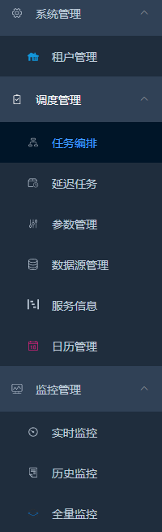

- 任务编排<br>

  - 任务列表<br>
    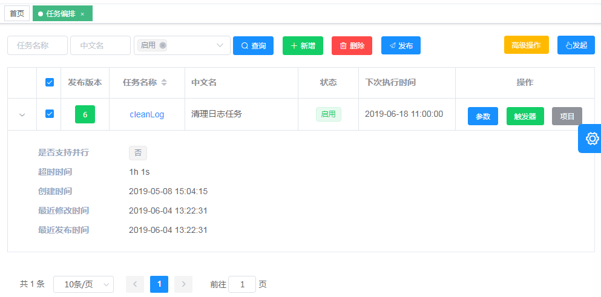
  - 任务流设计<br>
    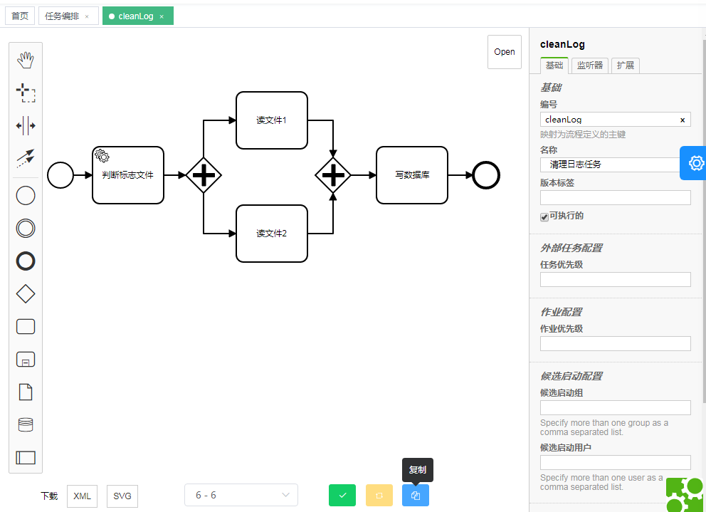

- 触发器<br>

  - cron 表达式触发器<br>
    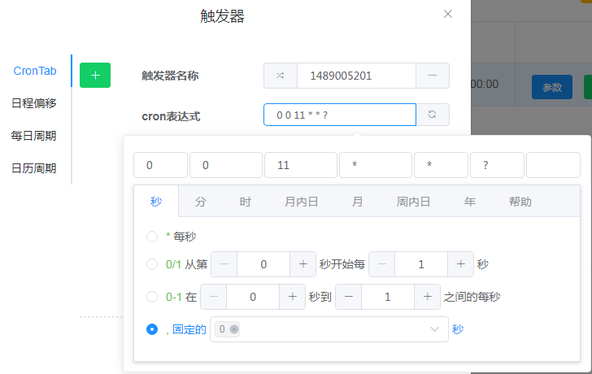
  - 日程偏移触发器<br>
    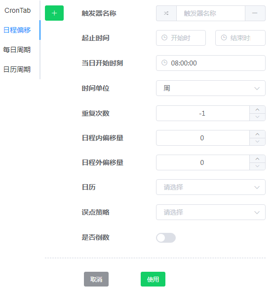
  - 每日周期触发器<br>
    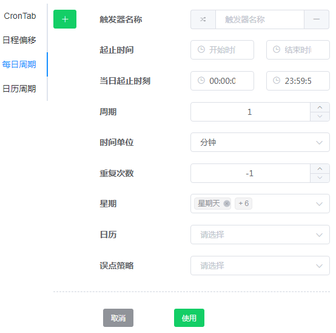
  - 日历周期触发器<br>
    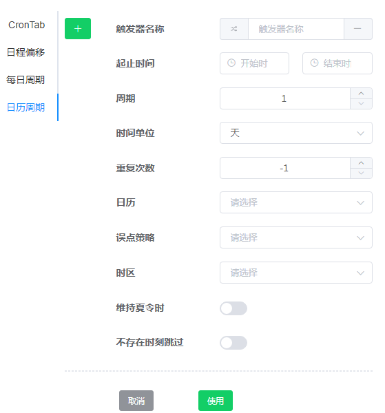

- 参数<br>
  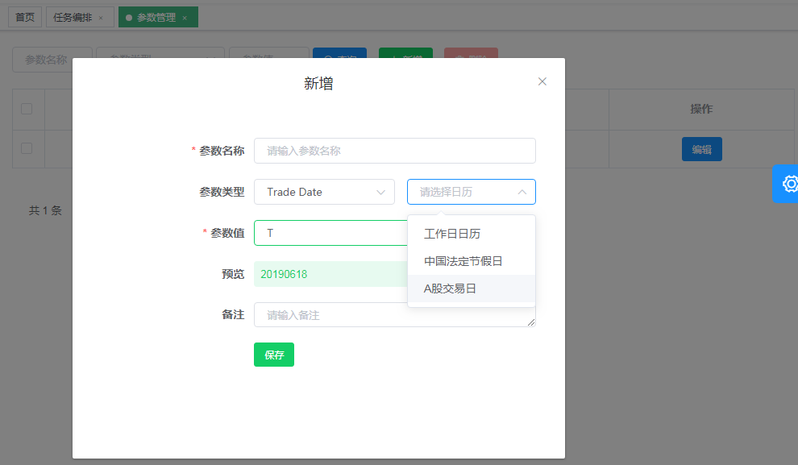
- 日历管理<br>
  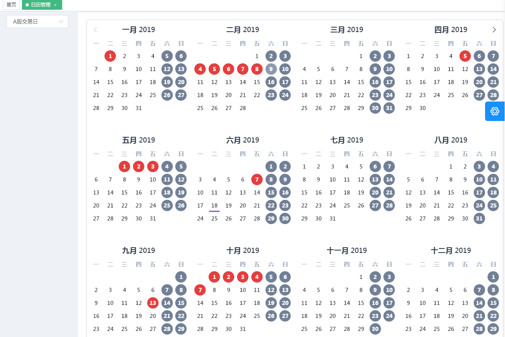

- 数据源管理<br>
  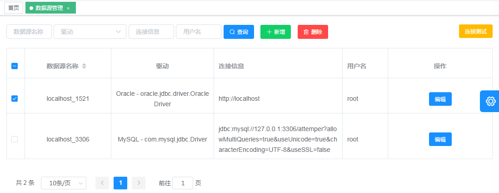

- 监控管理<br>
  - 监控列表
    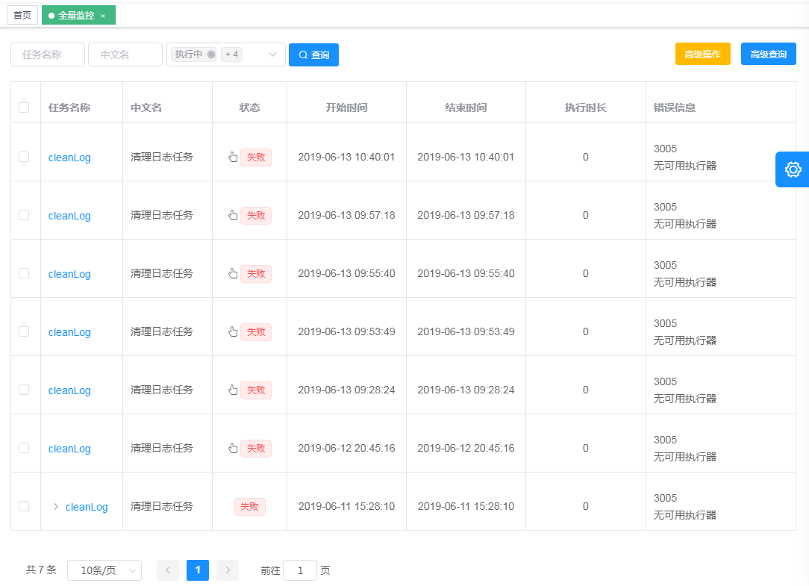
