# 配置示例

## 任务

### 新增任务

- 菜单:**调度管理**->**任务管理**，按钮**绿色加号**

| 配置字段       | 限制                          | 说明                                                                                                                                          |
| -------------- | ----------------------------- | --------------------------------------------------------------------------------------------------------------------------------------------- |
| 任务名称       | 数字 英文字母 - \_，64 字符内 | 任务唯一标识                                                                                                                                  |
| 中文名         | 255 字符内                    | 任务显示的中文名称                                                                                                                            |
| 状态           | 启用/禁用                     | 只有**启用**状态的任务才能被触发执行 PS:预上线或应急处理时可设为**禁用**                                                                      |
| 是否支持并行   | 是/否                         | 比如任务每 1 分钟执行一次，如果该任务上一次执行超过一分钟，那就可能并行执行，设置为**否**将拒绝本次执行并报错告警，设置为**是**则允许本次执行 |
| 当日仅执行一次 | 是/否                         | 当且仅当该任务当日只能成功执行一次时，可设置为**是**；可配合条件使用                                                                          |
| 备注           | 255 字符内                    | 任务的说明或备注                                                                                                                              |

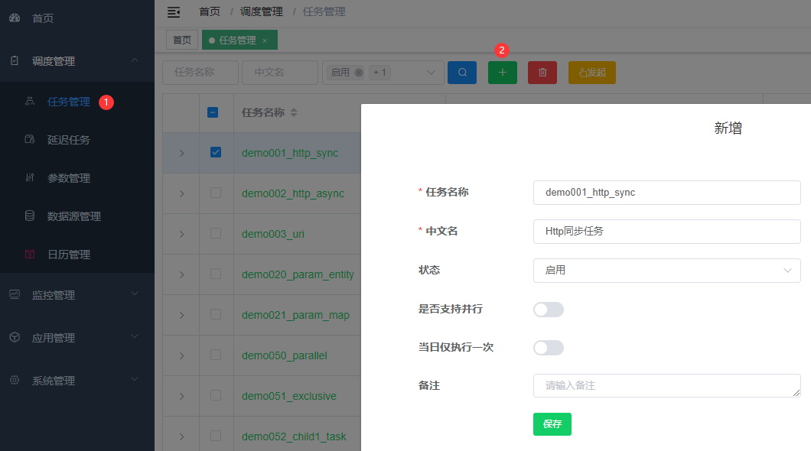

- 左击任务名称，进入流程图设计页面  
  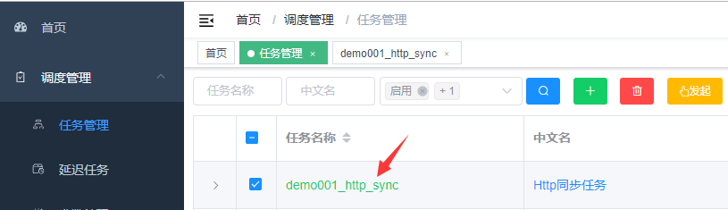

- 常用任务设计元素  
  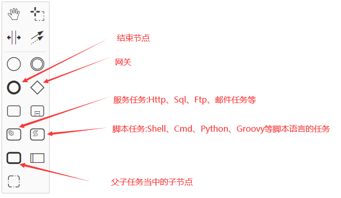

- 服务任务  
  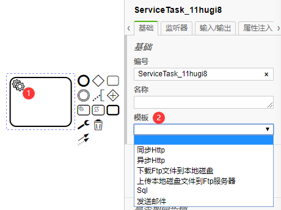

- 脚本任务  
  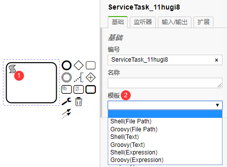

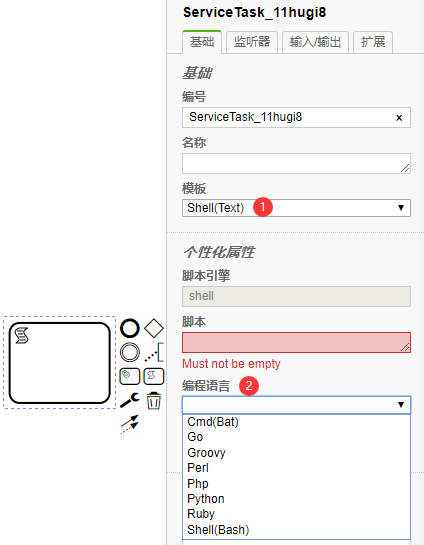

### Http 同步任务节点

- 配置和截图

| 配置字段      | 限制                                   | 说明                                                                                                                                                                                                                                                                                                      |
| ------------- | -------------------------------------- | --------------------------------------------------------------------------------------------------------------------------------------------------------------------------------------------------------------------------------------------------------------------------------------------------------- |
| 编号          | 建议英文字母开头                       | 节点唯一标识                                                                                                                                                                                                                                                                                              |
| 名称          | 无，建议中文                           | 节点中文名称，一个有意义的中文名称在告警时可快速定位问题                                                                                                                                                                                                                                                  |
| 模板          | 下拉选择                               | 调度中心为任务节点抽取了一些列任务模板，这些模板可以帮助业务系统在调度中心完成任务的执行或调用                                                                                                                                                                                                            |
| **Bean 名称** | 字符串，必须是业务系统的 Spring 组件   | Bean 需要使用@Service/@Component 等注解，若给它设置了名字，比如`@Service("myBean")`，这里应当配置为`myBean`，否则取类名的首字母小写（这不是绝对的，如果类名以连续大写开头，则不需要首字母小写）。举例如下`DemoBean`配为`demoBean`，`DEMOBean`配为`DEMOBean`，`DemoBean`（@Service("myBean")）配为`myBean` |
| **方法名称**  | 字符串，必须是 Bean 里面的`public`方法 | sdk 通过反射调用该方法，所以该方法必须为 public 修饰                                                                                                                                                                                                                                                      |
| 超时时间      | 数字                                   | 单位秒，默认 3600 秒(即 1 小时)                                                                                                                                                                                                                                                                           |

::: warning 注意
若任务类实现了`Executing`/`ExecutingWithParam`/`ExecutingWithResult`/`ExecutingWithParamAndResult`接口，则**方法名称**可为空
:::

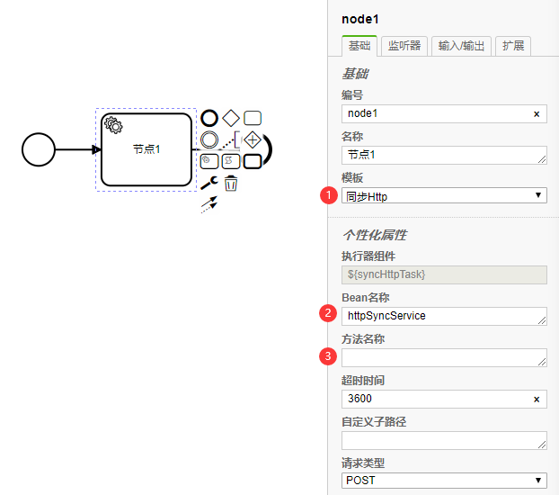

[查看 Http 同步任务 Demo](https://github.com/attemper/attemper-samples/blob/master/attemper-samples-task/src/main/java/com/github/attemper/samples/task/demo001/HttpSyncService.java)

### Http 异步任务节点

- 配置和截图

| 配置字段      | 限制                                   | 说明                                                                                                                                                                                                                                                                                                      |
| ------------- | -------------------------------------- | --------------------------------------------------------------------------------------------------------------------------------------------------------------------------------------------------------------------------------------------------------------------------------------------------------- |
| 编号          | 建议英文字母开头                       | 节点唯一标识                                                                                                                                                                                                                                                                                              |
| 名称          | 无，建议中文                           | 节点中文名称，一个有意义的中文名称在告警时可快速定位问题                                                                                                                                                                                                                                                  |
| 模板          | 下拉选择                               | 调度中心为任务节点抽取了一些列任务模板，这些模板可以帮助业务系统在调度中心完成任务的执行或调用                                                                                                                                                                                                            |
| **Bean 名称** | 字符串，必须是业务系统的 Spring 组件   | Bean 需要使用@Service/@Component 等注解，若给它设置了名字，比如`@Service("myBean")`，这里应当配置为`myBean`，否则取类名的首字母小写（这不是绝对的，如果类名以连续大写开头，则不需要首字母小写）。举例如下`DemoBean`配为`demoBean`，`DEMOBean`配为`DEMOBean`，`DemoBean`（@Service("myBean")）配为`myBean` |
| **方法名称**  | 字符串，必须是 Bean 里面的`public`方法 | sdk 通过反射调用该方法，所以该方法必须为 public 修饰                                                                                                                                                                                                                                                      |
| 超时时间      | 数字                                   | 单位秒，默认 3600 秒(即 1 小时)                                                                                                                                                                                                                                                                           |

::: warning 注意
若任务类实现了`Executing`/`ExecutingWithParam`/`ExecutingWithResult`/`ExecutingWithParamAndResult`接口，则**方法名称**可为空
:::

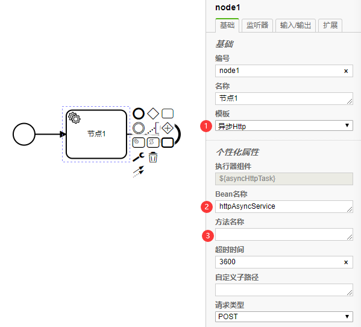

[查看 Http 异步任务 Demo](https://github.com/attemper/attemper-samples/blob/master/attemper-samples-task/src/main/java/com/github/attemper/samples/task/demo002/HttpAsyncService.java)

### 直接使用 URL 的 Http 任务节点

- 配置和截图

| 配置字段         | 限制                | 说明                                                                                           |
| ---------------- | ------------------- | ---------------------------------------------------------------------------------------------- |
| 编号             | 建议英文字母开头    | 节点唯一标识                                                                                   |
| 名称             | 无，建议中文        | 节点中文名称，一个有意义的中文名称在告警时可快速定位问题                                       |
| 模板             | 下拉选择            | 调度中心为任务节点抽取了一些列任务模板，这些模板可以帮助业务系统在调度中心完成任务的执行或调用 |
| 超时时间         | 数字                | 单位秒，默认 3600 秒(即 1 小时)                                                                |
| **自定义子路径** | 字符串              | HTTP 请求去掉 IP 地址、端口和 contextPath 后的路径                                             |
| **请求类型**     | POST/GET/PUT/DELETE | HTTP 请求类型                                                                                  |

`POST`
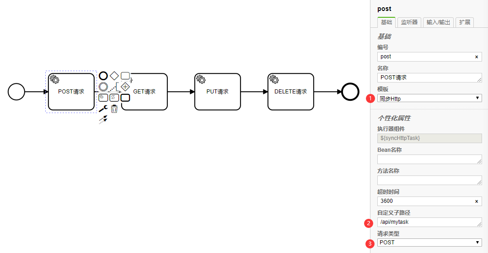

---

`GET`
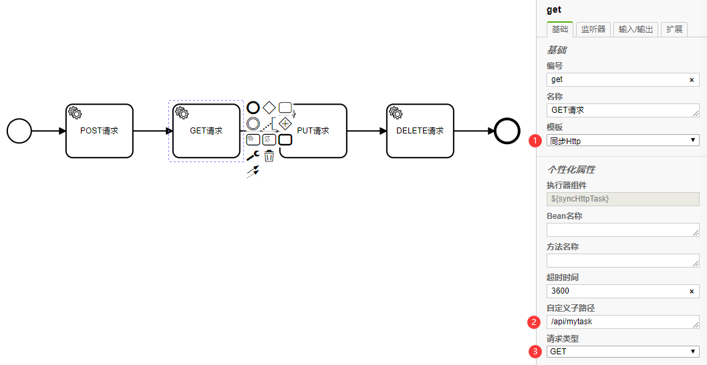

---

`PUT`
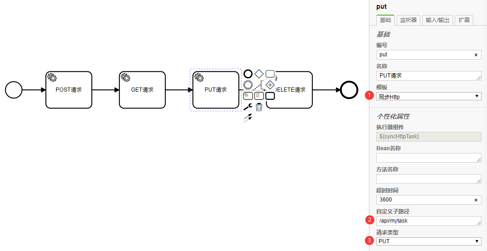

---

`DELETE`
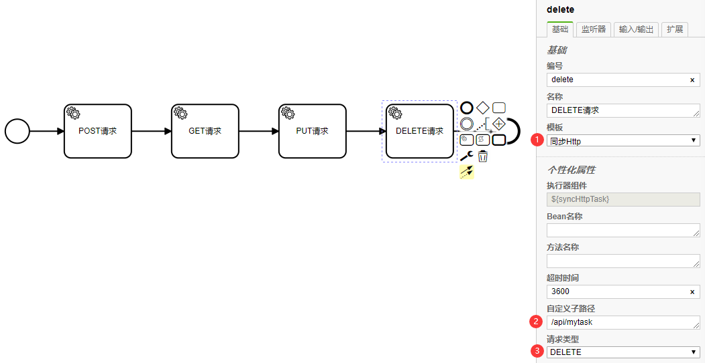

[查看直接使用 URI 的任务 Demo](https://github.com/attemper/attemper-samples/blob/master/attemper-samples-task/src/main/java/com/github/attemper/samples/task/demo003/UriTaskController.java)

### 并发任务节点

- 并发的图形是:**菱形**内嵌**几号**

::: warning 注意

- 在并发分支开始和结束，需要加上并发网关
- 由于`camunda`框架的乐观锁机制，要实现并发，必须勾选*执行前不加锁*、_执行后不加锁_，不能勾选串行执行
  :::

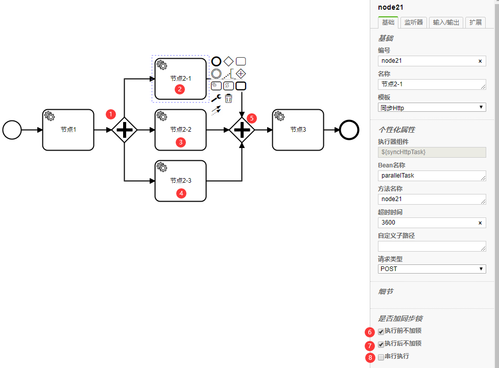

[查看并发任务 Demo](https://github.com/attemper/attemper-samples/blob/master/attemper-samples-task/src/main/java/com/github/attemper/samples/task/demo001/HttpSyncService.java)

### 判断分支

- 判断的图形是:**菱形**内嵌**X**
- 通过设定判断条件，任务可以根据条件结果，在运行时执行不同的节点
- 判断条件使用 EL 表达式进行计算

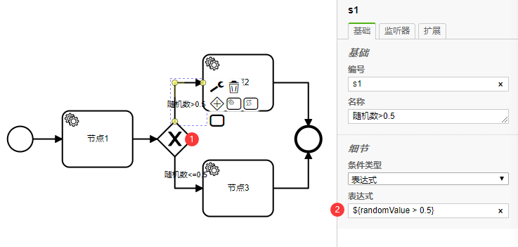

---

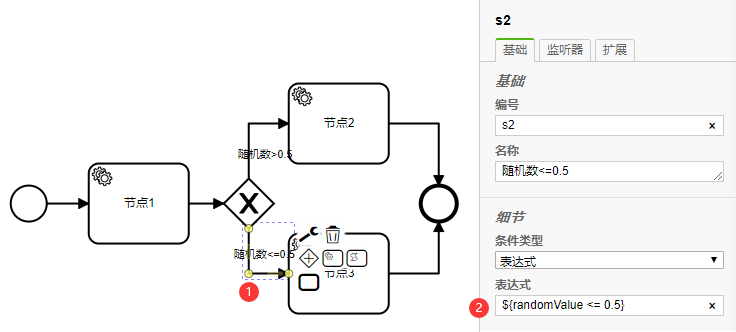

[查看判断分支 Demo](https://github.com/attemper/attemper-samples/blob/master/attemper-samples-task/src/main/java/com/github/attemper/samples/task/demo051/ExclusiveTask.java)

### 父子任务

- 判断的图形是:加粗的正方形
- 子任务名称是指任务列表中的任务名称
- 租户编号默认值会取当前租户，若要调用其他租户子任务，则在此填写该租户用户名即可
  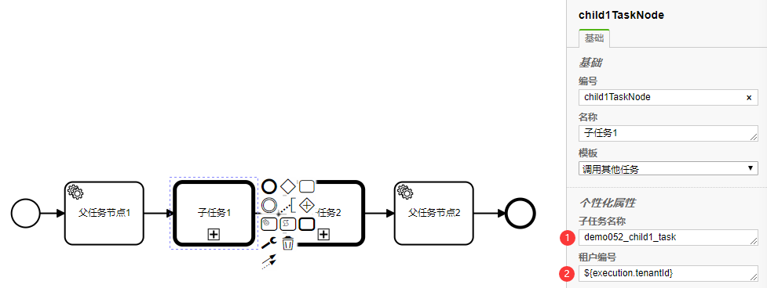

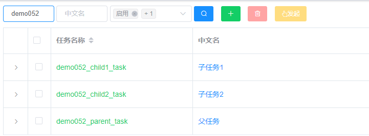

[查看父子任务 Demo](https://github.com/attemper/attemper-samples/tree/master/attemper-samples-task/src/main/java/com/github/attemper/samples/task/demo052)

### Sql 任务

`SELECT`:结果集将绑定参数名为`resultData`的参数，可在后置节点使用
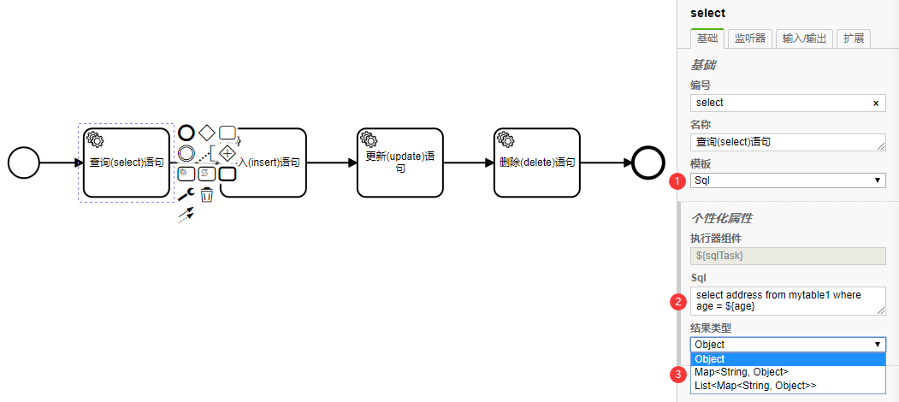

---

`INSERT`
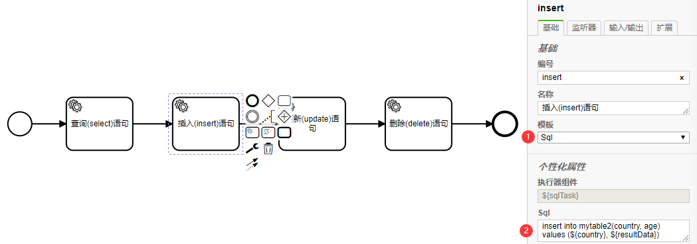

---

`UPDATE`
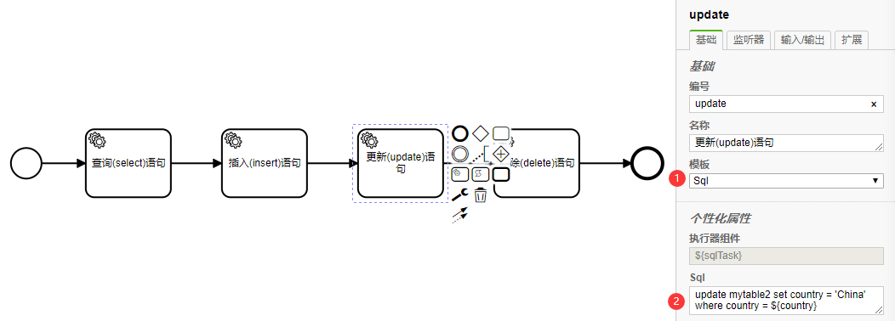

---

`DELETE`
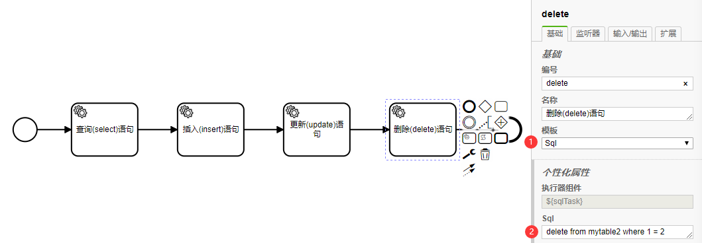

### FTP 下载任务

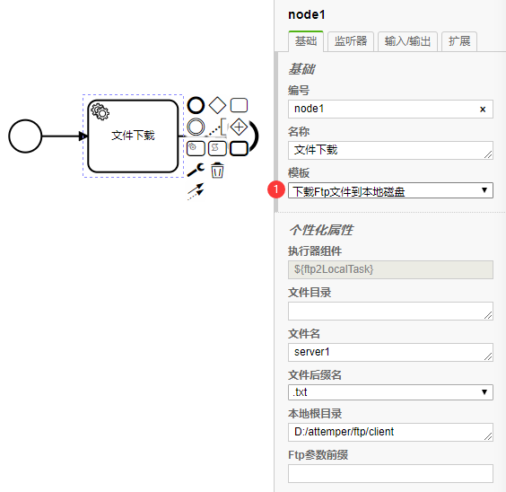

### FTP 上传任务

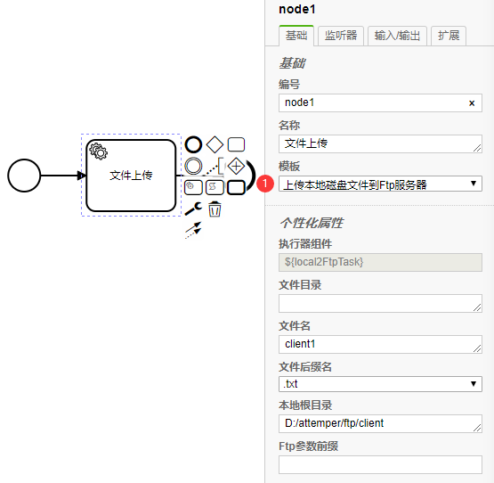

### 邮件发送任务

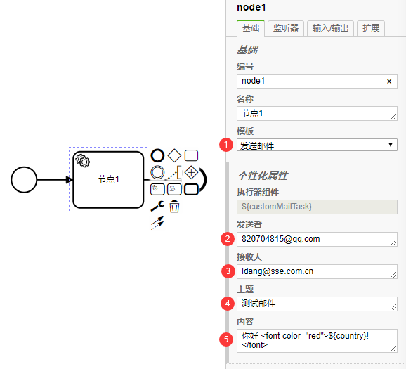

### Shell 脚本任务

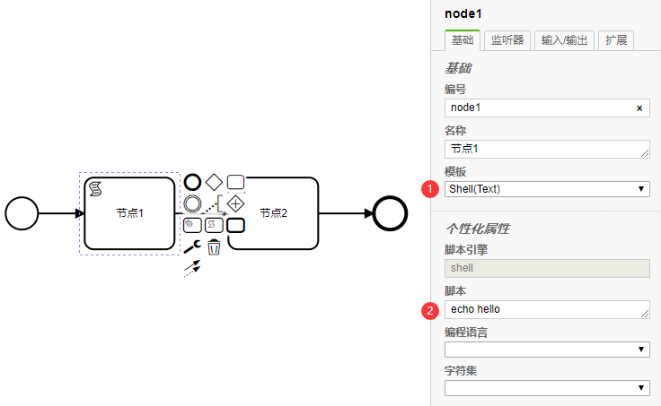

### Python 任务

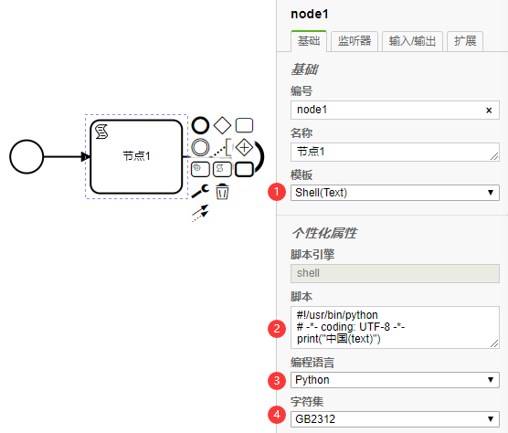

### 调用文件路径执行脚本任务

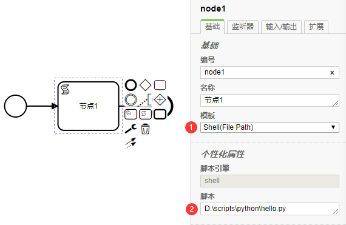

### 保存/发布/保存并发布

- 节点设计完成后，若*暂不使用，临时保存*，则点击**保存**
- 在*保存后若想发布*，则点击**发布**
- 在*编辑后需要直接发布的*，点击**保存并发布**

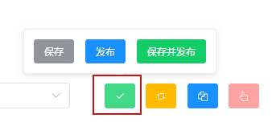

### 任务复制

提供快速复制任务功能，对相似配置的任务很有效

::: warning 注意
复制后的任务仅是模型，请按需修改配置，而后发布(保存/保存并发布)才能生效
:::

### 切换版本

提供将历史版本切换为最新版本的功能

::: warning 注意
切换后后，最新版本仅是模型，请按需修改配置，而后发布(保存/保存并发布)才能生效
:::

## 触发器

- 点击任务的触发器按钮，打开触发器对话框

通用配置

| 通用配置   | 限制                     | 说明                                                                                                                                                                                                |
| ---------- | ------------------------ | --------------------------------------------------------------------------------------------------------------------------------------------------------------------------------------------------- |
| 触发器名称 | 字符串                   | 点击左侧图标可直接设置，点击右侧图标可直接清除                                                                                                                                                      |
| 开始时间   | yyyy-mm-dd HH:mm:ss      | 留空或小于当前时间表示立即生效，大于当前时间则在该未来时刻生效。**一般留空**                                                                                                                        |
| 结束时间   | yyyy-mm-dd HH:mm:ss      | 如果设置截止时间，在该时间后触发器将失效。**一般留空**                                                                                                                                              |
| 日历       | 下拉选择，从日历管理获取 | 调度中心支持**工作日日历**、**中国法定节假日**和**A 股交易日**，以 A 股证券交易日历为例，将去掉所有周末和国家法定节假日，调休的工作日也被去掉，在去掉的日历内不会触发任务执行。留空表示一天都不去掉 |
| 误点策略   | 下拉选择                 | 不了解 quartz 的留空即可                                                                                                                                                                            |
| 时区       | 下拉选择                 | 不需要国际化时区的留空即可，默认跟随系统，中国的都是`Asia/Shanghai`                                                                                                                                 |

### Cron 表达式

Cron 表达式触发器是最常用的，借助调度中心提供的图形设计器和使用帮助，可以快速实现定时需求

| 个性配置    | 限制                  | 说明                                         |
| ----------- | --------------------- | -------------------------------------------- |
| cron 表达式 | 6 个时间单位 5 个空格 | 6 个时间单位分别是秒、分、时、日、月、周、年 |

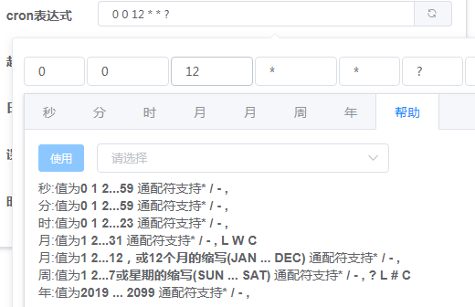

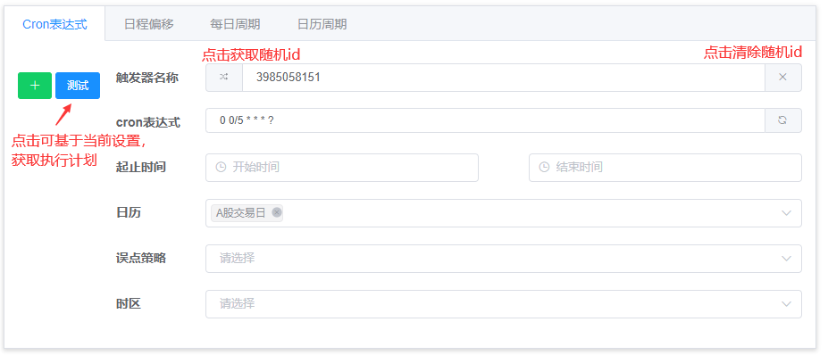

### 日程偏移

| 个性配置     | 限制           | 说明                                                                                           |
| ------------ | -------------- | ---------------------------------------------------------------------------------------------- |
| 当日开始时刻 | HH:mm:ss       | 当天的执行时刻                                                                                 |
| 时间单位     | 下拉选择       | 周、月、季度、半年、年                                                                         |
| 重复次数     | 整数           | -1 表示永远执行下去                                                                            |
| 日程内偏移量 | 整数           | 假设为 n，假如时间单位是*周*，不倒数，那就表示从每周第一天开始+n，如果超出日历，则计算下一周期 |
| 日程外偏移量 | 整数           | 假设为 n，假如时间单位是*周*，不倒数，那就表示从每周第一天开始+n，不论是否超出日历，都会生效   |
| 是否倒数     | `true`/`false` | 控制是从时间单位的第一天还是最后一天开始算起                                                   |

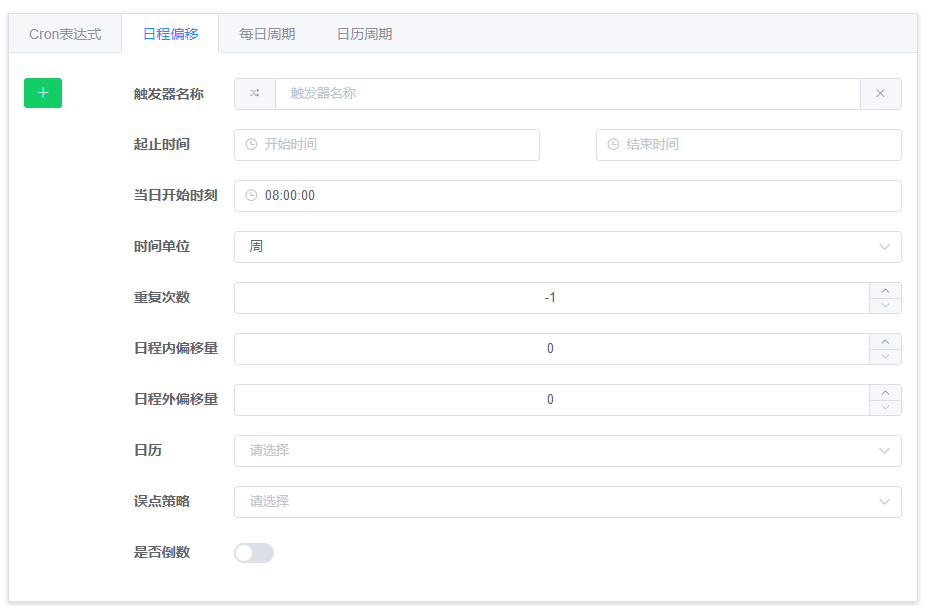

### 每日周期

| 个性配置 | 限制     | 说明                                  |
| -------- | -------- | ------------------------------------- |
| 起止时刻 | HH:mm:ss | 当天的执行开始到结束的时刻            |
| 周期     | 整数     | 若时间单位是周，则表示 N 周，以此类推 |
| 时间单位 | 下拉选择 | 毫秒、秒、分钟、小时                  |
| 重复次数 | 整数     | -1 表示永远执行下去                   |
| 星期     | 下拉选择 | 星期一到星期天                        |

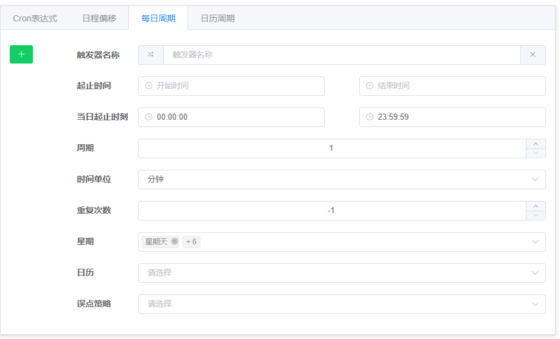

### 日历周期

| 个性配置       | 限制           | 说明                                     |
| -------------- | -------------- | ---------------------------------------- |
| 周期           | 整数           | 若时间单位是周，则表示 N 周，以此类推    |
| 时间单位       | 下拉选择       | 毫秒、秒、分钟、小时                     |
| 重复次数       | 整数           | -1 表示永远执行下去                      |
| 星期           | 下拉选择       | 星期一到星期天                           |
| 维持夏令时     | `true`/`false` | 对有夏令时调整的国家有效(中国没有夏令时) |
| 不存在时刻跳过 | `true`/`false` | 对于不存在的时刻跳过执行                 |

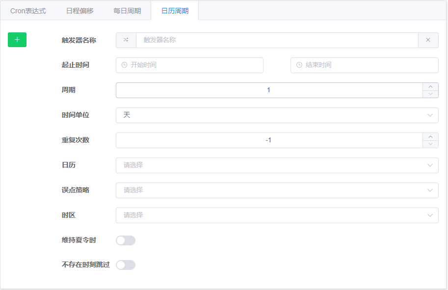

## 项目

- 菜单:**应用管理**->**项目管理**

### 配置多服务

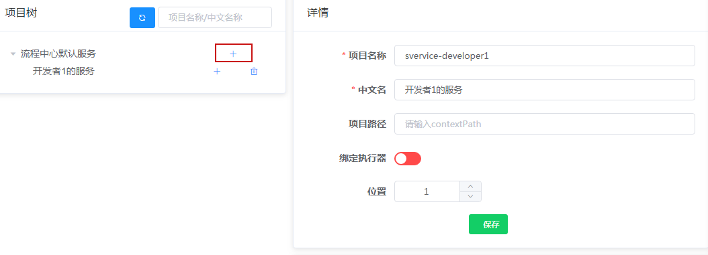

| 配置字段   | 限制                            | 说明                                                                                                                                                         |
| ---------- | ------------------------------- | ------------------------------------------------------------------------------------------------------------------------------------------------------------ |
| 项目名称   | 英文字母 数字 - \_的 255 字符内 | 建议取和自己服务相关的英文标识                                                                                                                               |
| 中文名称   | 255 字符                        | 能准确描述自己项目的项目名称                                                                                                                                 |
| 项目路径   | 字符串                          | 能访问到此项目的去掉 IP 端口后的路径。比如`spring boot`项目，若设置了`server.servlet.context-path`，则配置为该值                                             |
| 绑定执行器 | 是/否                           | 对于有些任务，可能依赖特定执行器的主机的资源，则需要绑定执行器。例如 python 脚本任务，需要某些执行器有相应的脚本环境或网络策略等，则需要绑定满足条件的执行器 |
| 位置       | 数字                            | 只影响排序                                                                                                                                                   |

### 服务信息

### 与任务绑定

- 点击任务的项目按钮，勾选目标服务完成绑定，如下图

## 参数

- 菜单: **调度管理**->**参数管理**

### Map

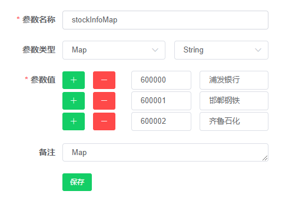

### List

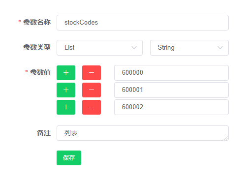

### Sql 参数

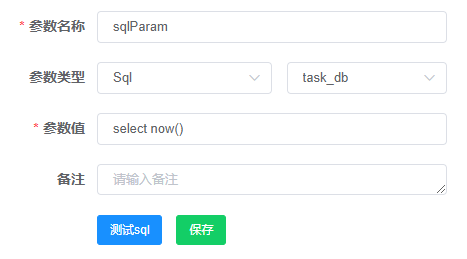

### 代码片段(Gist)参数

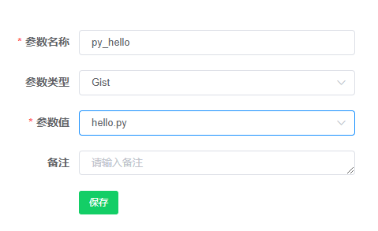

### 交易日(TradeDate)

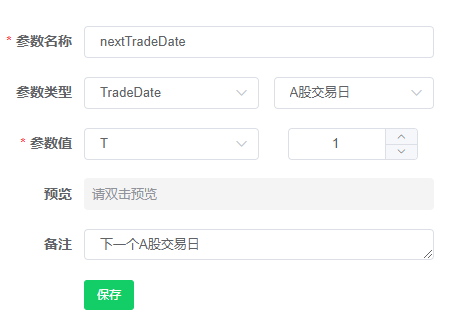

### 与任务绑定

- 点击任务的*触发器*按钮
  ::: tip 提示  
  点击_蓝色加号_后绑定  
  点击_红色减号_后解绑
  :::
  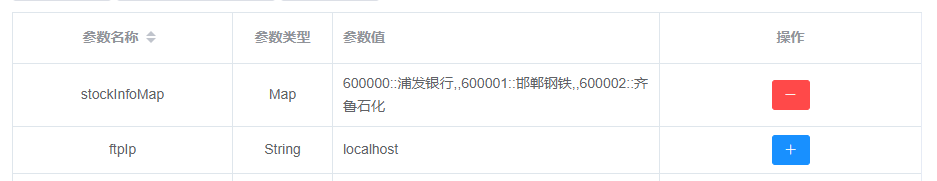

## 条件

- 点击任务的*条件*按钮

## 代码片段

- 菜单: **应用管理**->**代码片段**

### Python 示例

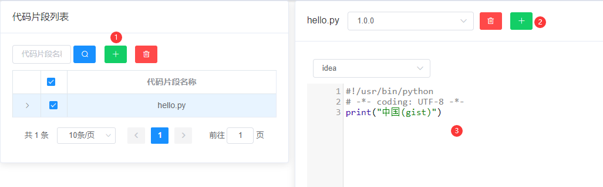

### 与参数绑定

请参考[代码片段(Gist)参数](/guide/essentials/config.md#代码片段-gist-参数)
