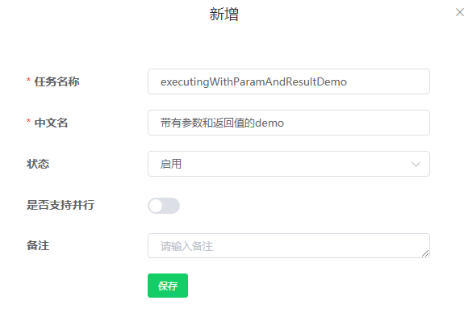
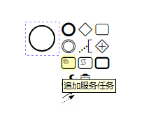
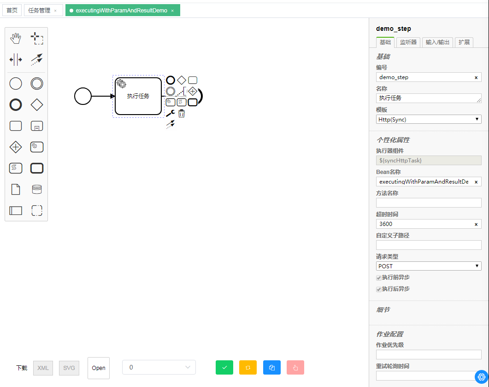
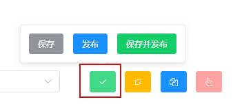
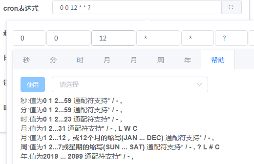
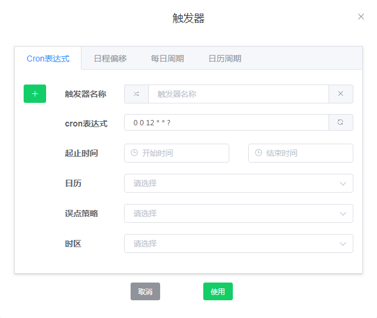
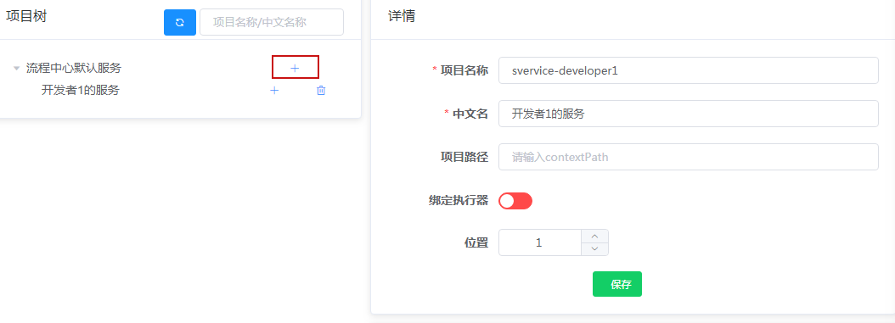
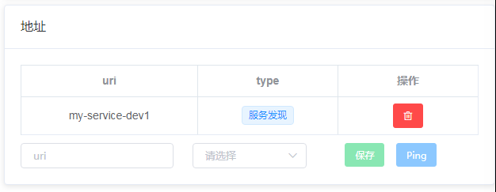

# 参考

## 任务

### 新增任务

- 任务管理 -> 绿色加号

| 配置字段     | 限制                          | 说明                                                                                                                                          |
| ------------ | ----------------------------- | --------------------------------------------------------------------------------------------------------------------------------------------- |
| 任务名称     | 数字 英文字母 - \_，64 字符内 | 任务唯一标识                                                                                                                                  |
| 中文名       | 255 字符内                    | 任务显示的中文名称                                                                                                                            |
| 状态         | 启用/禁用                     | 只有**启用**状态的任务才能被触发执行 PS:预上线或应急处理时可设为**禁用**                                                                      |
| 是否支持并行 | 是/否                         | 比如任务每 1 分钟执行一次，如果该任务上一次执行超过一分钟，那就可能并行执行，设置为**否**将拒绝本次执行并报错告警，设置为**是**则允许本次执行 |
| 备注         | 255 字符内                    | 任务的说明或备注                                                                                                                              |

- 左击新增的任务的名称，进入任务图设计页面

### 配置同步 Http 任务节点

- 鼠标按住开始节点，如下图所示，该标志是服务任务

- 进行如下图所示的同步 Http 任务节点的配置

| 配置字段 | 限制 |说明|
| ------------- | --------------------------- |----------|
|编号|建议英文字母开头|节点唯一标识|
|名称|无，建议中文|节点中文名称，一个有意义的中文名称在告警时可快速定位问题|
|模板|下拉选择|调度中心为任务节点抽取了一些列任务模板，这些模板可以帮助业务系统在调度中心完成任务的执行或调用|
|Bean 名称|字符串，必须是业务系统的 Spring 组件|Bean 需要使用@Service/@Component 等注解，若给它设置了名字，比如`@Service("myBean")`，这里应当配置为`myBean`，否则取类名的首字母小写（这不是绝对的，如果类名以连续大写开头，则不需要首字母小写）。举例如下`DemoBean`配为`demoBean`，`DEMOBean`配为`DEMOBean`，`DemoBean`（@Service("myBean")）配为`myBean`|
|方法名称|字符串，必须是 Bean 里面的`public`方法|sdk 通过反射调用该方法，所以该方法必须为 public 修饰|
|超时时间|数字|单位秒，默认 3600 秒(即 1 小时)|
|自定义子路径|字符串|对于非`Spring`框架的 web 项目，想要接入可以通过设置该参数，不再需要配置 bean 和方法|
|请求类型|POST/GET/PUT/DELETE|使用 sdk 默认是`POST`，如果是自定义路径来接入的，则可根据自身实际请求修改|

### 保存 or 发布

- 节点设计完成后，若**暂不使用，临时保存**，则点击保存
- 在**保存后若想发布**，则点击发布
- 在**编辑后需要直接发布的**，点击保存并发布

### 任务复制

调度中心提供快速复制任务功能，对于配置差不多的任务很有效

## 触发器

- 点击任务的触发器按钮，打开触发器对话框

### Cron 表达式

Cron 表达式触发器是最常用的，借助调度中心提供的图形设计器和使用帮助，可以快速实现定时需求

| 配置字段 | 限制 |说明|
|-------------|---------------------------|----------|
|触发器名称|字符串|左击其左侧图标可直接设置，左击其右侧图标可直接清除|
|cron 表达式|6 个时间单位 5 个空格|6 个时间单位分别是秒、分、时、日、月、周、年|
|开始时间|yyyy-mm-dd HH:mm:ss|留空或小于当前时间表示立即生效，大于当前时间则在该未来时刻生效。**一般留空**|
|结束时间|yyyy-mm-dd HH:mm:ss|如果设置截止时间，在该时间后触发器将失效。**一般留空**|
|日历|下拉选择，从日历管理获取|调度中心支持**工作日日历**、**中国法定节假日**和**A 股交易日**，以 A 股证券交易日历为例，将去掉所有周末和国家法定节假日，调休的工作日也被去掉，在去掉的日历内不会触发任务执行。留空表示一天都不去掉|
|误点策略|下拉选择|不了解 quartz 的留空即可|
|时区|下拉选择|不需要国际化时区的留空即可，默认跟随系统，中国的都是`Asia/Shanghai`|

## 项目

- 菜单：应用管理-项目管理

## 配置多服务

- **注：**任务不指定项目时，调度中心默认会找项目的根服务的配置，所以这里不是必须的

| 配置字段   | 限制                            | 说明                                                                                                                                                         |
| ---------- | ------------------------------- | ------------------------------------------------------------------------------------------------------------------------------------------------------------ |
| 项目名称   | 英文字母 数字 - \_的 255 字符内 | 建议取和自己服务相关的英文标识                                                                                                                               |
| 中文名称   | 255 字符                        | 能准确描述自己项目的项目名称                                                                                                                                 |
| 项目路径   | 字符串                          | 能访问到此项目的去掉 IP 端口后的路径。比如`spring boot`项目，若设置了`server.context-path`，则配置为该值                                                     |
| 绑定执行器 | 是/否                           | 对于有些任务，可能依赖特定执行器的主机的资源，则需要绑定执行器。例如 python 脚本任务，需要某些执行器有相应的脚本环境或网络策略等，则需要绑定满足条件的执行器 |
| 位置       | 数字                            | 只影响排序                                                                                                                                                   |

## 服务信息

## 任务与项目绑定

- 点击任务管理中任务的项目按钮，如下图，勾选目标服务完成绑定

