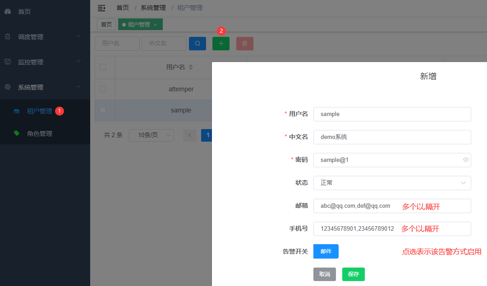
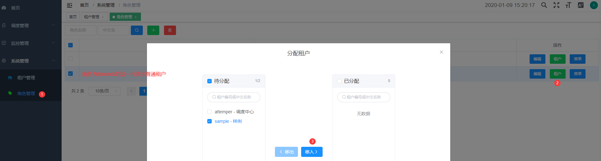

# 接入指南

## 申请租户

调度中心是一个支持多租户的分布式系统，这里的租户可以理解为一个业务系统或者一个微服务。  
使用调度中心的系统，应先向调度中心管理员（超管）申请普通租户，需提供以下信息：

- 系统简称
  建议字母、数字、下划线等
- 系统全称
- 告警方式配置
  在任务失败时，可通过此配置进行告警
  - 告警邮箱号
    多个则以英文逗号,隔开
  - 告警手机号
    例如 12345678901（可自行定制短信告警等），多个则以英文逗号,隔开

在我司生产中，我开发了**短信**和**企业微信**告警，因只有邮件告警有通用解决方案，故默认只支持邮件

## 配置租户

参考下图配置租户，并为其分配角色

- 超管登录

|   账号   |      密码      |
| :------: | :------------: |
| attemper | admin@Attemper |

- 配置租户  
  菜单:**系统管理**->**租户管理**，按钮:**绿色加号**  
  

- 分配角色  
  菜单:**角色管理**，点击角色名称为`tenants`所在行的**租户**按钮  
  将新增的租户分配给该角色
  

至此，完成普通租户的配置操作，该租户可登录系统验证

## 应用开发

按定时任务的实现语言，分了以下几类接入系统:

- Web 应用  
  [参见 Http 任务](/feature/dispatch/job.md#http-任务)
  - Spring Boot/MVC 应用  
    使用调度中心提供的 SDK
  - 其他 Web 应用(比如 J2EE/PHP 等)
    直接配置接口的 URL
- 脚本应用  
  [参见脚本任务](/feature/dispatch/job.md#shell-bash)  
  此类应用可直接在线编写脚本源码、代码片段或配置文件执行路径
  - Python
  - Shell
  - ...

本项目还提供了一系列带批处理逻辑的**模板任务**，比如邮件发送任务、SQL 任务、FTP 文件上传下载任务等，详情请参考模块[任务](/feature/dispatch/job.md#任务节点)
